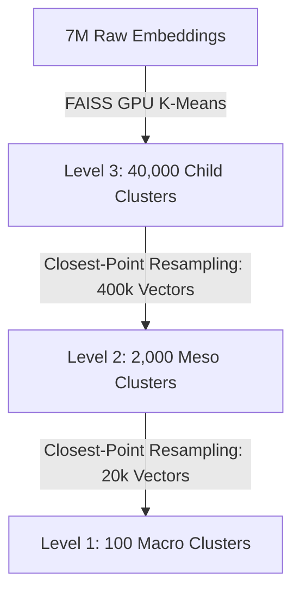

# Next-Generation Representation Clustering & Indexing Blueprint

This blueprint outlines the planned architectural shifts for the Geo-RAG representation clustering and spatial indexing system. These updates aim to address the limitations of flat double-K-Means and purely visual partitioning by integrating spatial contiguity, taxographical trees, and representative multi-medoid contexts.

---

## 🗺️ 1. Spatial-Semantic Joint Clustering

### Background & Objective
Currently, image clustering is performed purely in the visual embedding space. While this groups visually identical categories, it lacks spatial awareness, causing similar environments (e.g., agricultural fields in northern Finland and southern Spain) to share the same child clusters. To capture regional geographic contiguity, we will implement spatial-semantic joint spaces.

### Technical Design
We project geographical coordinates into a conformal 2D space using the Mercator projection and encode them into multi-scale representations using **Random Fourier Features (RFF)**. This design is directly based on the **G3 Geolocalization Framework (NeurIPS 2024)**, which demonstrates that continuous conformal projections aligned with visual-text representations achieve state-of-the-art results.

1. **Visual Embedding Normalization**:
   $$v_{\text{norm}} = \frac{v}{\|v\|_2}$$

2. **Mercator Coordinate Projection (Conformal)**:
   We transform radians of latitude ($\phi$) and longitude ($\lambda$) into plane coordinates:
   $$x = R \cdot (\lambda - \lambda_0)$$
   $$y = R \cdot \ln\left[ \tan\left( \frac{\pi}{4} + \frac{\phi}{2} \right) \right]$$
   where $R$ is a proportional constant of Earth's radius and $\lambda_0$ is the central meridian longitude.

3. **Multi-Scale Random Fourier Features (RFF) Mapping**:
   To capture both macro-scale (continental) and micro-scale (local) spatial variations, the projected coordinate $G_i = (x_i, y_i)$ is passed through a bank of Gaussian-frequency sinusoids:
   $$\gamma(G_i, \sigma_k) = [\cos(2\pi M G_i), \sin(2\pi S G_i)]^T$$
   where $M$ and $S$ are frequency matrices sampled from a Gaussian distribution $\mathcal{N}(0, \sigma_k)$. We compute representations across $K$ hierarchical frequency bands ($\sigma_{\text{min}}$ to $\sigma_{\text{max}}$) and aggregate them into the final continuous coordinate embedding:
   $$e_{\text{gps}} = \sum_{k=1}^K f_k(\gamma(G_i, \sigma_k))$$

4. **Concatenated Target Vector**:
   $$X_{\text{joint}} = [v_{\text{norm}} \;\|\; \lambda_{\text{spatial}} \cdot e_{\text{gps}}]$$

```
┌───────────────────────────────────────┬─────────────────────────┐
│  Visual Semantic Embeddings (768 Dim)  │ Multi-scale RFF Coords  │
│           Normalized to L2 = 1        │  Scaled by Weight (λ)   │
└───────────────────────────────────────┴─────────────────────────┘
```

### FAISS Execution Engine
* Since the spatial scaling parameter $\lambda_{\text{spatial}}$ alters the overall vector magnitude, we **cannot** use FAISS Spherical K-Means directly (as it normalizes inputs to unit length at training time, erasing the weight balance).
* Instead, we will use **FAISS L2 K-Means** (`spherical=False`) on GPU, which executes at high speed on flat concatenated arrays.

---

## 🌳 2. Resampling-Aware Cascaded K-Means Hierarchy

### Background & Objective
To bypass the quadratic space $O(N^2)$ and cubic time $O(N^3)$ computational bottlenecks of linkage-based agglomerative clustering on CPU, we adopt a **Resampling-Aware Cascaded K-Means** structure. This is directly inspired by the configuration design in `ssl-data-curation`'s `4levels_web_based_images.yaml` (which uses a bottom-up cascade of 10M $\rightarrow$ 500k $\rightarrow$ 50k $\rightarrow$ 10k clusters), but scaled down proportionally to fit our dataset of close to 7M images.

To prevent mathematical centroid drift (where parent centroids drift into sparse, empty regions of the embedding space), we implement a **Closest-Point Resampling** step between clustering levels. Instead of clustering centroids of centroids, we refit parent clusters on the actual database images that lie closest to the child centroids.

### Technical Design
We run flat FAISS GPU K-Means in a bottom-up cascade. Each step operates on a subset of real image embeddings sampled from the active clusters of the previous level. Since the subset size at each subsequent level is compressed by over a factor of 10, the complexity remains strictly linear $O(N)$ and runs in milliseconds on GPU.



### Scale Comparison with `ssl-data-curation`
The following table shows how we scale down the Meta/ssl-data-curation config to fit our 7M image scope:

| Level | `ssl-data-curation` Config (Billion-scale) | Our Geobotanical Config (7M Scale) | Input Source |
| :--- | :--- | :--- | :--- |
| **Level 3 (Fine)** | 10,000,000 clusters (100k $\times$ 100 splits) | **40,000 clusters** (Child / Leaves) | Raw visual-spatial embeddings |
| **Level 2 (Meso)** | 500,000 clusters | **2,000 clusters** (Sub-categories) | Resampled Level 3 leaf points |
| **Level 1 (Macro)** | 50,000 / 10,000 clusters | **100 clusters** (Macro-categories) | Resampled Level 2 centroids |

### Code Implementation
We implement the resampling using a fast, vectorized NumPy helper:

```python
def sample_closest_points(embeddings_norm, cluster_ids, centroids, n_samples=10):
    """
    Selects the N points closest to each centroid from within their respective clusters.
    Inspired by ssl-data-curation's closest-to-centroid sampling strategy.
    """
    sampled_indices = []
    for cid in range(len(centroids)):
        mask = (cluster_ids == cid)
        if not np.any(mask):
            continue
        indices = np.where(mask)[0]
        if len(indices) <= n_samples:
            sampled_indices.extend(indices)
        else:
            # Vectorized dot product for cosine similarity (since vectors are normalized)
            similarities = np.dot(embeddings_norm[indices], centroids[cid])
            top_k = np.argsort(similarities)[-n_samples:]
            sampled_indices.extend(indices[top_k])

    return np.array(sampled_indices, dtype=np.int64)
```

In `cluster_images_global.py`, we execute the cascaded runs in sequence:
1. **Stage 1 (Leaves)**: Run standard FAISS K-Means on raw visual-spatial vectors: `faiss.Kmeans(d, 40000, spherical=False)`.
2. **Resampling 1**: Call `sampled_leaf_indices = sample_closest_points(embeddings_norm, child_cluster_ids, child_centroids, n_samples=10)` (subset of $\le 400,000$ vectors).
3. **Stage 2 (Meso)**: Cluster the resampled leaf vectors: `faiss.Kmeans(d, 2000, spherical=True)`.
4. **Resampling 2**: Call `sampled_meso_indices = sample_closest_points(embeddings_norm[sampled_leaf_indices], meso_cluster_ids, meso_centroids, n_samples=10)` (subset of $\le 20,000$ vectors).
5. **Stage 3 (Macro)**: Cluster the resampled meso vectors: `faiss.Kmeans(d, 100, spherical=True)`.
6. **Index Mapping**: Map every database record to `cluster_id` (Level 3), `meso_cluster_id` (Level 2), and `macro_cluster_id` (Level 1) in the Parquet file.

---

## 🔄 3. Adaptive Centroid Splitting and Merging

### Background & Objective
In `assign` mode, new images are mapped to static centroids. Over multiple scraping cycles, this leads to semantic drift and over-congestion of active centroids.

### Technical Design
We will wrap FAISS searches in an adaptive update loop that dynamically splits or merges centroids based on local data density.

1. **Variance Tracking**: Compute average cosine similarity and point counts for each child cluster during incremental assignments.
2. **Centroid Splitting**: If a cluster's population exceeds a limit or its average cosine similarity drops below a threshold (indicating multiple sub-concepts are merged inside), the centroid is duplicated and perturbed with small random Gaussian noise:
   $$c_1 = c + \epsilon, \quad c_2 = c - \epsilon$$
3. **Centroid Merging**: If centroids drift too close (cosine similarity $> 0.95$), they are merged into a single cluster.
4. **Local FAISS Refinement**: Run 3–5 iterations of local FAISS K-Means on the affected subsets to stabilize cluster boundaries.

---

## 📷 4. Multi-Medoid Composite Thumbnail Labeling

### Background & Objective
Multi-Modal LLMs (VLMs) can hallucinate or mislabel a cluster if the single medoid image chosen to represent it contains an anomaly (e.g. a bird flying in front of a forest). We will feed the MLLM a composite view of the cluster.

### Technical Design
We will replace single-medoid prompts with composite grids showing the visual variance of the cluster.

```
┌─────────────────────────┐
│     Composite Medoid    │
├────────────┬────────────┤
│  Medoid 1  │  Medoid 2  │
├────────────┼────────────┤
│  Medoid 3  │  Medoid 4  │
└────────────┴────────────┘
```

1. **Candidate Retrieval**: Query the top-10 nearest neighbors to a cluster centroid using FAISS: `index.search(centroid, 10)`.
2. **Heuristic Selection**: Use a max-min distance heuristic in Python to select 4 candidate images that are mutually diverse (capturing variations in lighting, season, and perspective within the cluster).
3. **Stitched Image Generation**: Concatenate the 4 images into a $2\times2$ image collage.
4. **Multi-Aspect VLM Prompting**: Send this single stitched collage to the VLM. The prompt directs the model to analyze the common features across all four sub-frames, resulting in highly generalizable, robust, and clean LULC labels.
