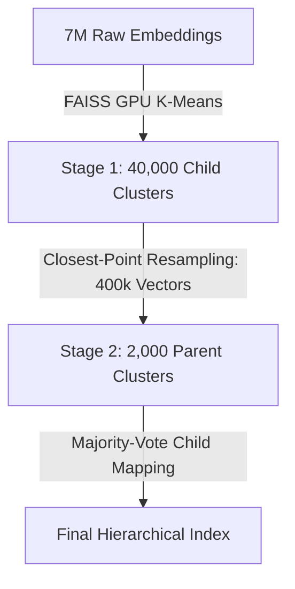

# Next-Generation Representation Clustering & Indexing Blueprint

This blueprint outlines the planned architectural shifts for the Geo-RAG representation clustering and spatial indexing system. These updates address the limitations of flat double-K-Means and purely visual partitioning by integrating spatial contiguity, visual resampling, and representative multi-medoid contexts.

---

## 🌳 1. Global Resampling-Aware 2-Stage K-Means Hierarchy

### Background & Objective
Our parent clustering originally ran K-Means on child centroids. Because centroids represent mathematical averages of averages, this caused "centroid drift," pulling parent categories into sparse, empty regions of the visual embedding space.

To resolve this, we adopt a **Global Resampling-Aware 2-Stage K-Means** hierarchy. Instead of clustering centroids, we perform a closest-point resampling step to extract the most representative real image embeddings from each child cluster, and cluster *those* images to find the parent categories.

### Technical Design
The pipeline operates globally on the GPU using FAISS:



1. **Stage 1 (Leaves / Child)**:
   * Cluster the 7M raw visual embeddings into $k = 40,000$ child clusters on the GPU using FAISS Spherical K-Means.
2. **Closest-Point Resampling**:
   * For each of the 40,000 child clusters, we retrieve the top $N = 10$ image embeddings closest to its centroid (using cosine similarity). This creates a highly representative subset of $\le 400,000$ vectors.
3. **Stage 2 (Categories / Parent)**:
   * Cluster these $400,000$ resampled vectors into $k_{\text{parents}} = 2,000$ parent groups (using a division factor of $K // 20$) using FAISS GPU K-Means.
4. **Majority-Vote Child Mapping**:
   * Assign parent IDs back to the 40,000 child centroids using a majority vote of the resampled points belonging to each child cluster, mapping them to the `parent_cluster_id` column.

### Code Implementation
We use a fast, vectorized NumPy sampler in `cluster_images_global.py`:

```python
def sample_closest_points(embeddings_norm, cluster_ids, centroids, n_samples=10):
    """
    Selects the N points closest to each centroid from within their respective clusters.
    If a cluster has fewer than N images, all available images are selected.
    """
    sampled_indices = []
    for cid in range(len(centroids)):
        mask = (cluster_ids == cid)
        if not np.any(mask):
            continue
        indices = np.where(mask)[0]
        if len(indices) <= n_samples:
            sampled_indices.extend(indices)
        else:
            similarities = np.dot(embeddings_norm[indices], centroids[cid])
            top_k = np.argsort(similarities)[-n_samples:]
            sampled_indices.extend(indices[top_k])

    return np.array(sampled_indices, dtype=np.int64)
```

---

## 📷 2. Multi-Medoid Film-Strip Labeling

### Background & Objective
Multi-Modal LLMs (VLMs) can hallucinate or mislabel a cluster if the single medoid image chosen to represent it contains an anomaly (e.g. a tourist selfie, a vehicle, or a close-up signpost). To make auto-labeling robust against this web-scraping noise, we feed the VLM a composite view of the cluster.

### Technical Design
Instead of single-medoid images, we stack four mutually diverse nearest-neighbor images vertically into a single **Film-Strip Collage**.

```
┌─────────────────────────────────┐
│     Vertical Film Strip         │
├─────────────────────────────────┤
│  Medoid 1 (Primary / Center)    │
├─────────────────────────────────┤
│  Medoid 2 (Seasonal Variant)    │
├─────────────────────────────────┤
│  Medoid 3 (Visual Variant)      │
├─────────────────────────────────┤
│  Medoid 4 (Lighting Variant)    │
└─────────────────────────────────┘
```

1. **Aspect-Ratio Preserving Letterboxing**:
   * To prevent Mapillary panoramas from stretching, each of the 4 images is resized to fit inside a standard $512 \times 256$ (2:1 aspect ratio) cell.
   * Any unused space inside the cell is padded with a neutral dark-gray background (`#282828`).
2. **Vertical Stitching**:
   * The 4 cells are stacked vertically into a single $512 \times 1024$ JPEG file (less than 80 KB).
3. **Multi-Aspect VLM Prompting (Stage 1)**:
   * The single composite image is sent to sglang. The prompt instructs the model to synthesize the dominant, common land-cover features across the vertical stack rather than treating it as a single photo:
     *"The input image contains a vertical stack of 4 representative photographs from the same local cluster; analyze the common land-cover features across these frames..."*
4. **Composite Metadata Aggregation (Stage 2)**:
   * Since the 4 images represent different sample points within the same semantic-spatial cluster, we compile aggregated metadata for the Stage 2 classification prompt:
     - **Location**: Bounding box and centroid of the 4 coordinates.
     - **Region/Country**: List of unique countries represented.
     - **Climate & Season**: List of unique climates and seasons represented.
   * This prevents the MLLM from overfitting to a single coordinate or a single photo's season, making the classification robust to temporal/spatial anomalies.
