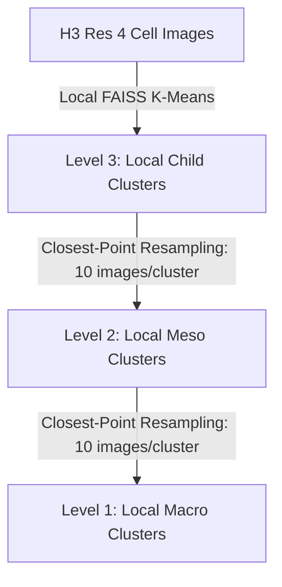

# Next-Generation Representation Clustering & Indexing Blueprint

This blueprint outlines the planned architectural shifts for the Geo-RAG representation clustering and spatial indexing system. These updates aim to address the limitations of flat double-K-Means and purely visual partitioning by integrating spatial contiguity, taxographical trees, and representative multi-medoid contexts.

---

### 🗺️ 1. H3-Restricted Local Visual Clustering (Primary Training-Free Design)

### Background & Objective
In a training-free pipeline, we cannot train projection networks (such as G3's learned contrastive Geo-alignment layers) to align the scales of coordinate representations and visual embeddings. Concatenating raw coordinates with normalized visual embeddings is highly unstable and requires intensive, sensitive tuning of the spatial weight hyperparameter $\lambda$.

To enforce geographic contiguity without manual tuning or model training, we adopt **Discrete H3-Restricted Visual Clustering**. We use H3 cells at a coarse resolution as hard boundaries to bucket images geographically, and then cluster visually *within* those cells.

### Technical Design
We partition the dataset into a small, stable set of coarse H3 cells, run standard K-Means locally on visual embeddings inside each cell, and map the visual clusters back to fine-grained locations.

```
[ 7M Images ]
     │
     ▼  (Geographic Bucketing by H3 Resolution 4 Cells)
┌─────────────────────────┐ ┌─────────────────────────┐
│ H3 Cell A (~11,000 km²) │ │ H3 Cell B (~11,000 km²) │
└────────────┬────────────┘ └────────────┬────────────┘
             ▼                           ▼
      (Local K-Means)             (Local K-Means)
   500 visual clusters         1,000 visual clusters
```

1. **Coarse Partitioning (H3 Resolution 4/5)**:
   * Divide the Earth's land surface into coarse H3 cells. At Resolution 4, there are only $\approx$ 2,016 active cells globally, keeping the classification buckets fixed and scale-invariant.
   * Group the 7M images into these coarse buckets based on their geographic coordinates.
2. **Local Visual K-Means**:
   * Within each coarse cell, run standard FAISS Spherical K-Means (`spherical=True` / cosine distance) purely on the normalized visual embeddings $v_{\text{norm}}$.
   * This completely bypasses the need for coordinate concatenation and eliminates the $\lambda$ hyperparameter.
3. **Fine-Grained Mapping (H3 Resolution 11)**:
   * Every image belongs to a specific Resolution 11 cell (deduplication level) and has a local visual cluster ID.
   * The Resolution 11 cells simply inherit the visual cluster IDs of the images they contain, allowing users to zoom in to 50-meter coordinates on the map while keeping the clustering computation lightweight.

---

## 🌳 2. Resampling-Aware Local Cascaded K-Means (Within H3 Blocks)

### Background & Objective
To bypass the quadratic space $O(N^2)$ computational bottleneck of linkage trees on the CPU, we run **Cascaded K-Means** locally inside each coarse H3 cell. To prevent parent categories from drifting into empty regions of the high-dimensional embedding space, we perform closest-point resampling between the levels of the local cascade.

### Technical Design
We run local FAISS GPU K-Means in a bottom-up sequence within each active H3 Resolution 4 cell:



### Scale Hierarchy
Within each active H3 Resolution 4 cell, we set a proportional hierarchy:
* **Level 3 (Child / Leaves)**: Set dynamically using the auto-find-$k$ validation script on the local images (e.g. $k^* = 500$ clusters).
* **Level 2 (Meso / Sub-categories)**: Set to $k_{\text{meso}} = k^* / 20$ (e.g. 25 clusters).
* **Level 1 (Macro / Categories)**: Set to $k_{\text{macro}} = k_{\text{meso}} / 20$ (e.g. 2 clusters).

### Code Implementation
We extract representative image indexes from the raw embeddings using a fast, vectorized NumPy sampler:

```python
def sample_closest_points(embeddings_norm, cluster_ids, centroids, n_samples=10):
    """
    Selects the N points closest to each centroid from within their respective clusters.
    Inspired by ssl-data-curation's closest-to-centroid sampling strategy.
    """
    sampled_indices = []
    for cid in range(len(centroids)):
        mask = (cluster_ids == cid)
        if not np.any(mask):
            continue
        indices = np.where(mask)[0]
        if len(indices) <= n_samples:
            sampled_indices.extend(indices)
        else:
            # Vectorized dot product for cosine similarity (since vectors are normalized)
            similarities = np.dot(embeddings_norm[indices], centroids[cid])
            top_k = np.argsort(similarities)[-n_samples:]
            sampled_indices.extend(indices[top_k])

    return np.array(sampled_indices, dtype=np.int64)
```

For each active coarse H3 cell:
1. **Local Stage 1 (Leaves)**: Run standard FAISS Spherical K-Means on the cell's image embeddings: `faiss.Kmeans(d, k_child, spherical=True)`.
2. **Resampling 1**: Call `sample_closest_points` to gather the 10 closest images to each child centroid (creating a subset of $\le 5,000$ vectors).
3. **Local Stage 2 (Meso)**: Cluster the resampled child vectors: `faiss.Kmeans(d, k_meso, spherical=True)`.
4. **Resampling 2**: Call `sample_closest_points` on the Meso subset (creating a subset of $\le 250$ vectors).
5. **Local Stage 3 (Macro)**: Cluster the resampled meso vectors: `faiss.Kmeans(d, k_macro, spherical=True)`.
6. **Majority Mapping**: Map child IDs to parent IDs vectorially, and write the hierarchical columns (`cluster_id`, `meso_cluster_id`, `macro_cluster_id`) directly to the Parquet database.

---

## 🔄 3. Adaptive Centroid Splitting and Merging

### Background & Objective
In `assign` mode, new images are mapped to static centroids. Over multiple scraping cycles, this leads to semantic drift and over-congestion of active centroids.

### Technical Design
We will wrap FAISS searches in an adaptive update loop that dynamically splits or merges centroids based on local data density.

1. **Variance Tracking**: Compute average cosine similarity and point counts for each child cluster during incremental assignments.
2. **Centroid Splitting**: If a cluster's population exceeds a limit or its average cosine similarity drops below a threshold (indicating multiple sub-concepts are merged inside), the centroid is duplicated and perturbed with small random Gaussian noise:
   $$c_1 = c + \epsilon, \quad c_2 = c - \epsilon$$
3. **Centroid Merging**: If centroids drift too close (cosine similarity $> 0.95$), they are merged into a single cluster.
4. **Local FAISS Refinement**: Run 3–5 iterations of local FAISS K-Means on the affected subsets to stabilize cluster boundaries.

---

## 📷 4. Multi-Medoid Composite Thumbnail Labeling

### Background & Objective
Multi-Modal LLMs (VLMs) can hallucinate or mislabel a cluster if the single medoid image chosen to represent it contains an anomaly (e.g. a bird flying in front of a forest). We will feed the MLLM a composite view of the cluster.

### Technical Design
We will replace single-medoid prompts with composite grids showing the visual variance of the cluster.

```
┌─────────────────────────┐
│     Composite Medoid    │
├────────────┬────────────┤
│  Medoid 1  │  Medoid 2  │
├────────────┼────────────┤
│  Medoid 3  │  Medoid 4  │
└────────────┴────────────┘
```

1. **Candidate Retrieval**: Query the top-10 nearest neighbors to a cluster centroid using FAISS: `index.search(centroid, 10)`.
2. **Heuristic Selection**: Use a max-min distance heuristic in Python to select 4 candidate images that are mutually diverse (capturing variations in lighting, season, and perspective within the cluster).
3. **Stitched Image Generation**: Concatenate the 4 images into a $2\times2$ image collage.
4. **Multi-Aspect VLM Prompting**: Send this single stitched collage to the VLM. The prompt directs the model to analyze the common features across all four sub-frames, resulting in highly generalizable, robust, and clean LULC labels.
