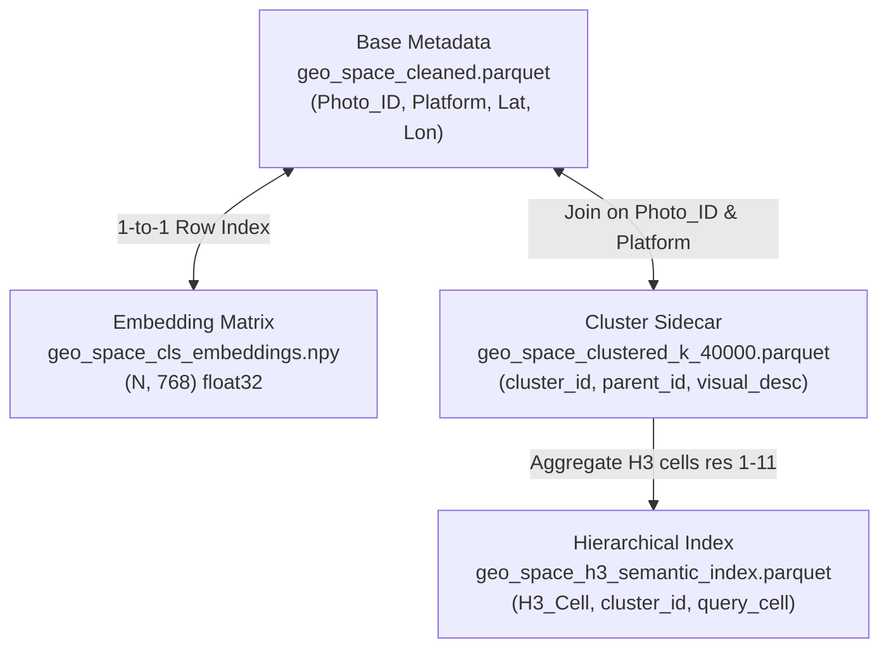

# Geo-RAG Dataset Structure & Guide

This document describes the structure, formats, and design of the dataset outputs generated by the Geo-RAG spatial-semantic mapping pipeline.

---

## 📂 File Directory & Descriptions

| File Name | Format | Approximate Size | Description |
| :--- | :--- | :--- | :--- |
| **`geo_space_deduplicated.parquet`** | Apache Parquet | ~250 MB | Core metadata of all scraped images (Flickr, Mapillary, iNaturalist, etc.) after duplicate coordinates and identical images are pruned. |
| **`geo_space_cleaned.parquet`** | Apache Parquet | ~227 MB | Cleaned base metadata subset, generated by filtering out coordinate locking anomalies (GPS glitches). **This is the primary base metadata file for down-stream tasks.** |
| **`geo_space_cls_embeddings.npy`** | NumPy Binary Matrix | ~15.9 GB | Decoupled feature representations matrix of shape `(N, 768)` containing float32 CLS token embeddings. Rows align 1-to-1 with the base metadata parquets. |
| **`geo_space_clustered_k_40000.parquet`** | Apache Parquet | ~2.0 GB | Decoupled cluster sidecar containing `cluster_id`, VLM-generated visual descriptions, and parent mapping nodes for $k = 40,000$ clusters. |
| **`geo_space_h3_semantic_index.parquet`** | Apache Parquet | ~3.7 MB | Aggregated lookup index mapping H3 cells across resolutions 1 through 11 to their dominant semantic categories, seasons, and cluster IDs. |
| **`cluster_samples_k_40000.html`** | HTML/JS Dashboard | ~40 KB | Standalone interactive visual dashboard showing representative images, VLM labels, and outlier boundaries for each cluster. |
| **`cluster_samples_k_40000_data.js`** | JavaScript Object | ~291 MB | Data payload powering the visual dashboard, containing coordinate and metadata mappings for cluster centroids. |
| **`cluster_semantic_scatter_k_40000.html`** | HTML/JS Plot | ~40 MB | Interactive 2D UMAP scatter plot showing the semantic relationships and visual grouping of the 40,000 cluster centroids. |
| **`cluster_semantic_scatter_k_40000.png`** | Static Image | ~6.6 MB | Static high-resolution rendering of the UMAP semantic clustering layout. |
| **`global_cluster_map.html`** | Leaflet Map | ~35 MB | Interactive map displaying centroid coordinates, markers, and metadata descriptions of clusters globally. |
| **`global_dataset_map.html`** | Leaflet Map | ~11 MB | Global visualization of all deduplicated metadata sample coordinates. |
| **`global_h3_occupancy_map.html`** | Leaflet Map | ~23 MB | Aggregated global density map showing data volume per H3 hexagon. |
| **`global_h3_semantic_map.html`** | Leaflet Map | ~1 MB | Global categorical thematic map displaying spatial distributions of semantic classes. |
| **`global_dataset_stats.png`** / **`.txt`** | Stats Plot & Report | ~380 KB / ~6 KB | Overall summary reports, count statistics, and distribution plots of the dataset. |
| **`cluster_count_validation.png`** | Plot | ~77 KB | Silhouette/Elbow validation plot used for optimal cluster count estimation. |

---

## 📐 Decoupled Storage Architecture

To conserve SSD storage and system RAM, the dataset uses a **decoupled architecture** where heavy embedding matrices, base metadata, and cluster mappings are stored separately but remain mathematically linked:



1. **1-to-1 Row Alignment:**
   The $i$-th row of the NumPy matrix in `geo_space_cls_embeddings.npy` corresponds *exactly* to the $i$-th row of the metadata in `geo_space_cleaned.parquet`. Slicing operations can be performed directly on disk via memory-mapping (`mmap_mode="r"`).
2. **Sidecar Merging:**
   The cluster assignments parquet (`geo_space_clustered_k_40000.parquet`) does not duplicate heavy coordinates or URLs. It links back to the base metadata using the primary key: `['Platform', 'Photo_ID']`.

---

## 🐍 Loading Data in Python

Always load the data using the provided backward-compatible utility functions in `src/utils/io.py` to ensure sidecars and embeddings are resolved and merged transparently.

### 1. Loading Metadata + Cluster Columns
The helper automatically resolves path mappings, loads the base metadata, and merges the cluster sidecar columns transparently:
```python
from src.utils.io import load_dataset_with_clusters

# Pass the sidecar path directly; it auto-resolves base file and merges
df = load_dataset_with_clusters(
    "full_pipeline_output/geo_space_clustered_k_40000.parquet",
    k_clusters=40000
)

# df will contain: 'Latitude', 'Longitude', 'Image_URL', 'cluster_id', 'cluster_label', etc.
print(df.shape)
```

### 2. Loading Embeddings Matrix
The embeddings loader dynamically resolves slices using the parquet file's index mappings:
```python
from src.utils.io import load_embeddings

# Loads the memory-mapped float32 matrix sliced to match your parquet rows
embeddings = load_embeddings(
    "full_pipeline_output/geo_space_clustered_k_40000.parquet"
)

print(embeddings.shape) # (N, 768)
```
