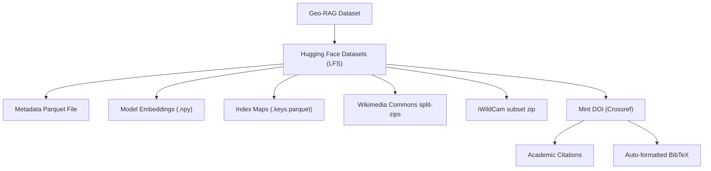

# 🗺️ Geo-RAG Dataset Publication Roadmap

This roadmap outlines the best practices, legal considerations, and steps for publishing the **Geo-RAG** dataset for public research.

---

## ⚖️ 1. Image Data vs. Licensing (The "Should the images be included?" question)

Directly hosting and distributing raw scraped images is a common challenge in dataset publication due to copyright restrictions.

### Option A: Metadata + Embeddings Only (Recommended Standard)
This is the methodology used by major datasets (e.g., LAION, CC12M).
* **What to distribute**:
  1. The metadata Parquet database (`geo_space_deduplicated.parquet`) containing `photo_key`, `Latitude`, `Longitude`, `Platform`, `Captured_At`, and `License`.
  2. The pre-computed model embeddings (`.npy` files) for DINOv3, TIPSv2, etc. (Embeddings are legal to distribute as they are mathematical derivatives and cannot reconstruct the original images).
  3. A robust, multi-threaded **image downloading script** (e.g., a cleaned-up version of `src/utils/download_images.py`) so researchers can recreate the image folder locally.
* **Pros**: 100% legally safe; extremely lightweight; avoids hosting large image archives.
* **Cons**: Subject to "link rot" (images deleted by uploaders on Flickr or Mapillary won't be downloadable in the future).

### Option B: CC-Only Image Archive
* **What to distribute**: The dataset is filtered to group only images with open licenses (e.g., `CC0`, `CC-BY`, `CC-BY-SA`). These are packaged into a compressed zip archive and hosted. All "All Rights Reserved" images are excluded from the zip but remain download-able via the script.
* **Pros**: Provides a plug-and-play subset for quick evaluation while complying with copyright law.
* **Cons**: Requires additional data filtering and increases hosting storage needs.

### Option C: Hybrid Hosting for Offline & Rate-Limited Subsets (Wikimedia, iWildCam)
Some parts of the dataset have unique hosting constraints:
* **Wikimedia Commons**: Wikimedia Commons heavily rate-limits and blocks rapid automated API downloads, making direct scripting unreliable. Furthermore, the Wikimedia Commons subset is very large (approx. 102.5 GB).
* **iWildCam Subset**: This is a custom pre-filtered subset of the iWildCam 2022 dataset that is not hosted in this exact form anywhere else.
* **Solution**: Since both Wikimedia Commons and iWildCam images are under open-access/Creative Commons licenses, these sub-folders can be packaged and hosted directly as companion downloads on the **Hugging Face** repository (which natively supports very large file storage via Git LFS).
* **Large-File Delivery Best Practice (100+ GB)**: To prevent download timeouts and corruption errors over public connections, the 102.5 GB Wikimedia Commons archive should be split into **multi-part zip volumes** (e.g., 10 GB parts: `wikimedia_commons_subset.zip.001`, `wikimedia_commons_subset.zip.002`, etc.) before upload.

---

## 🏛️ 2. Where to Host the Dataset?

To make the dataset discoverable and citable in research papers, it should be hosted on a single repository that provides permanent identifiers.

### Hugging Face Datasets (Unified Platform)
* **What it is**: The gold standard for modern machine learning dataset sharing.
* **Benefits**:
  * **Scalable Storage**: Supports Git LFS with no size ceilings, making it ideal for the 102.5 GB Wikimedia Commons chunks.
  * **Built-in DOI Minting**: Allows minting a permanent, citable academic **DOI** directly through Hugging Face dataset settings (registered via Crossref).
  * **Community Usability**: Allows users to load the dataset in 1 line of code: `load_dataset("username/geo-rag")`.
  * **Interactive Previews**: Renders interactive tabular previews of the Parquet file on the web interface.

---

## 📅 3. Publication Roadmap Phases

| Phase | Milestone | Action Items |
| :--- | :--- | :--- |
| **Phase 1: Sanitization** | Clean Metadata & Code | <ul><li>Verify all git history is free of API keys.</li><li>Add license classifications (`cc0`, `cc-by`, etc.) to the database.</li><li>Replace `google_landmarks` platform name references with `wikimedia_commons` in the metadata.</li></ul> |
| **Phase 2: Package** | Prepare Embeddings & Chunks | <ul><li>Backfill all benchmark model embeddings (DINOv3, TIPSv2) using the updated utility.</li><li>Compress the iWildCam folder and split the 102.5 GB Wikimedia Commons folder into 10 GB volumes.</li><li>Write a clear `download_dataset.sh` script for the repository.</li></ul> |
| **Phase 3: Host** | Upload to Hugging Face | <ul><li>Create a Hugging Face Dataset repository.</li><li>Configure Git LFS tracking for `.zip`, `.npy` and `.keys.parquet` files.</li><li>Upload the Parquet database, `.npy` embeddings, `.keys.parquet` index maps, zip volumes, and `README.md`.</li></ul> |
| **Phase 4: Publish** | Mint DOI & Reference | <ul><li>Go to Dataset Settings and click **"Mint DOI"** to generate the permanent academic identifier.</li><li>Add the minted DOI badge and BibTeX citation block to the main `README.md`.</li></ul> |

---

## 📄 4. Attribution & Data Citations
When scraping from platforms like **GBIF**, **iNaturalist**, and **Mapillary**, attribution sections must be included.
* **Flickr/Mapillary**: Provide a link to the Terms of Service in the documentation.
* **GBIF/iNaturalist**: GBIF datasets require citing the specific download DOI. Ensure the GBIF download query ID is located and linked in the documentation.
