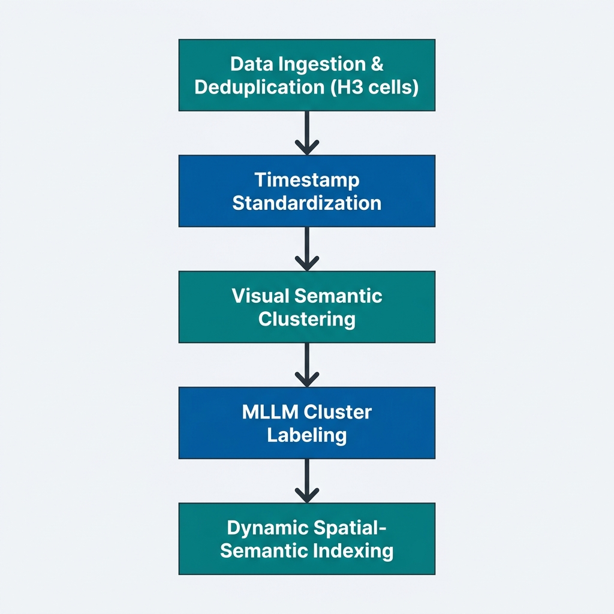

# Geo-RAG Pipeline Guide & Architecture

This document serves as the master overview and index for the Geo-RAG spatial-semantic data engineering, clustering, and mapping pipeline.

---

## 🗺️ 1. Pipeline Overview & Architecture

The pipeline is designed to ingest raw street-level and outdoor image databases, deduplicate them spatially, cluster them semantically using image embeddings, auto-label clusters using Multi-Modal LLMs (MLLMs), and build interactive web visualizations.

---

## ⚙️ 2. Pipeline Walkthrough & Stages

Detailed documentation for each stage of the pipeline can be found in the sub-guides below:

| Stage | Script / Utility | Core Responsibility | Details |
| :--- | :--- | :--- | :--- |
| **01. Ingestion & Scraping** | `src/scrapers/*` | Flickr, Mapillary, KartaView and iNaturalist scraping, spatial difference masking. | [Detailed Guide ➡️](pipeline/01_ingestion_scraping.md) |
| **02. Spatial Deduplication** | `process_scraped_data.py` | H3 Resolution 11 grouping, single-pass feature extraction, decoupled `.npy` format, VRAM streaming updates. | [Detailed Guide ➡️](pipeline/02_spatial_deduplication.md) |
| **03. Timestamp Standardization** | `standardize_timestamps.py` | Capture datetime normalization, climate zoning, boundary country snapping, EPSG:3857 coastal buffer. | [Detailed Guide ➡️](pipeline/03_timestamp_standardization.md) |
| **04. Coordinate Anomaly Cleanup** | `cleanup_coordinate_anomalies.py` | locked-latitude parallel GPS glitch purges. | [Detailed Guide ➡️](pipeline/04_coordinate_cleanup.md) |
| **05. Optimal k Estimation** | `validate_cluster_count.py` | Spatial Block Hold-Out validation, reconstruction loss curves, Elbow heuristic estimation. | [Detailed Guide ➡️](pipeline/05_optimal_k_estimation.md) |
| **06. Global GPU Clustering** | `cluster_images_global.py` | Semantic drift outlier tracking, fit vs assign decisioning, FAISS Spherical child clustering & resampling-aware parent hierarchy. | [Detailed Guide ➡️](pipeline/06_clustering_dynamic_drift.md) |
| **07. MLLM Cluster Labeling** | `label_clusters_mllm.py` | Nvidia Docker SGLang lifecycle manager, multi-medoid film-strip collages, visual description prompting, text ecological categorization. | [Detailed Guide ➡️](pipeline/07_mllm_labeling.md) |
| **08. Spatial-Semantic Indexing** | `build_spatial_semantic_index.py` | H3 multi-resolution spatial index aggregation. | [Detailed Guide ➡️](pipeline/08_spatial_semantic_indexing.md) |
| **09. Visualization Dashboards** | `src/visualization/*` | Leaflet density/semantic maps, WebGL UMAP projections, HTML grids, and reports. | [Detailed Guide ➡️](pipeline/09_visualization_dashboards.md) |

---

## 💾 3. Data Versioning (DVC)

To handle heavy files (Parquet databases, HTML maps, images), `run_full_pipeline.sh` implements autonomous DVC standalone tracking:

1. **HDD Storage**: Outputs are written to a fast SSD, then backed up to a high-capacity HDD directory tracked by DVC.
2. **Push**: Pushes heavy data to remote storage using `dvc push`.
3. **Git Sync**: Copies the updated `.dvc` tracking files back to the SSD Git repository, automatically commits them, and pushes them to track repository state changes.

---

## 📚 4. Literature & Software References

* Brodsky, A. (2018). *H3: Uber's Hexagonal Hierarchical Spatial Index*. Uber Engineering. [https://h3geo.org](https://h3geo.org)
* Dhillon, I. S., & Modha, D. S. (2001). Concept decompositions for large sparse text document collections with applications to high-dimensional clustering. *Machine Learning*, 42(1), 143–175.
* Johnson, J., Douze, M., & Jégou, H. (2019). Billion-scale similarity search with GPUs. *IEEE Transactions on Big Data*, 7(3), 535–547.
* McInnes, L., Healy, J., & Melville, J. (2018). UMAP: Uniform Manifold Approximation and Projection for Dimension Reduction. *arXiv preprint arXiv:1802.03426*.
* Cao, B., Chen, K., Maninis, K. K., Chen, K., Karpur, A., Xia, Y., ... & Araujo, A. (2026). Tipsv2: Advancing vision-language pretraining with enhanced patch-text alignment. *CVPR 2026*.
* Sculley, D. (2010). Web-scale k-means clustering. In *Proceedings of the 19th International Conference on World Wide Web* (pp. 1177–1178).
* Thorndike, R. L. (1953). Who belongs in the family? *Psychometrika*, 18(4), 267–276.
* Tobler, W. R. (1970). A computer movie simulating urban growth in the Detroit region. *Economic Geography*, 46(sup1), 234–240.
* Beck, H. E., T. R. McVicar, N. Vergopolan, A. Berg, N. J. Lutsko, A. Dufour, Z. Zeng, X. Jiang, A. I. J. M. van Dijk, and D. G. Miralles. High-resolution (1 km) Köppen-Geiger maps for 1901–2099 based on constrained CMIP6 projections. Scientific Data 10, 724 (2023).
