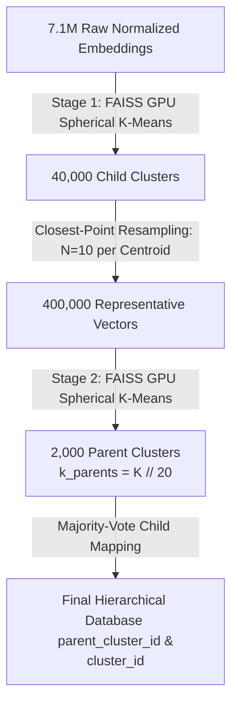

# Step 2: Global FAISS GPU Clustering & Semantic Drift Detection

This document describes the design and operation of `cluster_images_global.py` and `check_semantic_drift.py`, which handle dynamic clustering mode decisions, FAISS-based GPU Spherical K-Means clustering, and hierarchical grouping.

---

## ⚙️ Automated Mode Selection (Fit vs Assign)

To optimize computation time and avoid unnecessary MLLM labeling costs, the pipeline dynamically determines whether to perform full re-clustering (`fit` mode) or map new images to existing centroids (`assign` mode) using a scale-proof semantic drift detector:

### 1. Dynamic Drift Analysis (`check_semantic_drift.py`)
If a clustered Parquet database file already exists on disk for the current $k$, the pipeline extracts embeddings from the new images. It queries these embeddings against the old centroids using FAISS and measures their cosine similarities.

### 2. `fit` Mode (Re-cluster and Label)
Triggered under any of the following conditions:
* No pre-existing clustered database exists for the space.
* The target cluster count $k$ configured in `params.yaml` has changed.
* **Significant semantic drift is detected**: More than 3% of the new images are classified as outliers, meaning they have a cosine similarity of $< 0.70$ with all existing centroids.

In `fit` mode, it runs full FAISS Spherical K-Means and triggers downstream VLM auto-labeling.

### 3. `assign` Mode (Map to Centroids)
Triggered if the pre-existing clustered database exists and the semantic distribution of new images is stable (outliers $\le 3\%$).
* **Zero VLM Cost**: Rather than re-clustering all data and re-running expensive MLLMs, it dynamically calculates the centroid coordinates from the existing Parquet database in memory, maps the new images to their nearest centroids using FAISS nearest-neighbor search, and maps existing VLM labels/descriptions to the new images. This executes in seconds.

---

## 🌳 Global Resampling-Aware 2-Stage K-Means Hierarchy

### Background & Motivation
Traditional hierarchical clustering often runs parent K-Means directly on child centroid vectors. Because centroids are mathematical averages of averages, this can cause "centroid drift," pulling parent categories into sparse, empty regions of the visual embedding space.

To resolve this, Geo-RAG adopts a **Global Resampling-Aware 2-Stage K-Means** hierarchy in `cluster_images_global.py`. Instead of clustering mathematical centroids, the system performs a closest-point resampling step to extract real representative image embeddings from each child cluster, and clusters *those* images to establish the parent categories.



### Technical Workflow

1. **Stage 1 (Fine-Grained Child Clustering)**:
   * Partitions the raw visual embeddings into $k = 40,000$ fine-grained child clusters using FAISS Spherical K-Means on the GPU:
   ```python
   faiss.Kmeans(d, k, niter=20, spherical=True, gpu=True)
   ```
2. **Closest-Point Resampling**:
   * For each child cluster, retrieves the top $N = 10$ image embeddings closest to its centroid (via cosine similarity). This creates a representative subset of up to $400,000$ real image vectors.
   * If a cluster has fewer than $N$ points, all available members are selected.
3. **Stage 2 (Hierarchical Parent Clustering)**:
   * Clusters the $400,000$ resampled vectors into $k_{\text{parents}} = 2,000$ parent categories (using a division factor of $K // 20$) via FAISS GPU Spherical K-Means.
4. **Majority-Vote Child Mapping**:
   * Maps parent cluster IDs back to the $40,000$ child clusters using a majority vote of the resampled points belonging to each child cluster, populating the `parent_cluster_id` column.

### Type Resilience & Immediate Persistence
* Coordinate columns are cast to numeric `float64` right after loading to preserve schema alignment during final Parquet export.
* Cluster assignments are written to the database (`geo_space_clustered_k_{num_clusters}.parquet`) and heavy embedding matrices are immediately released from RAM to avoid CPU memory bottlenecks.
