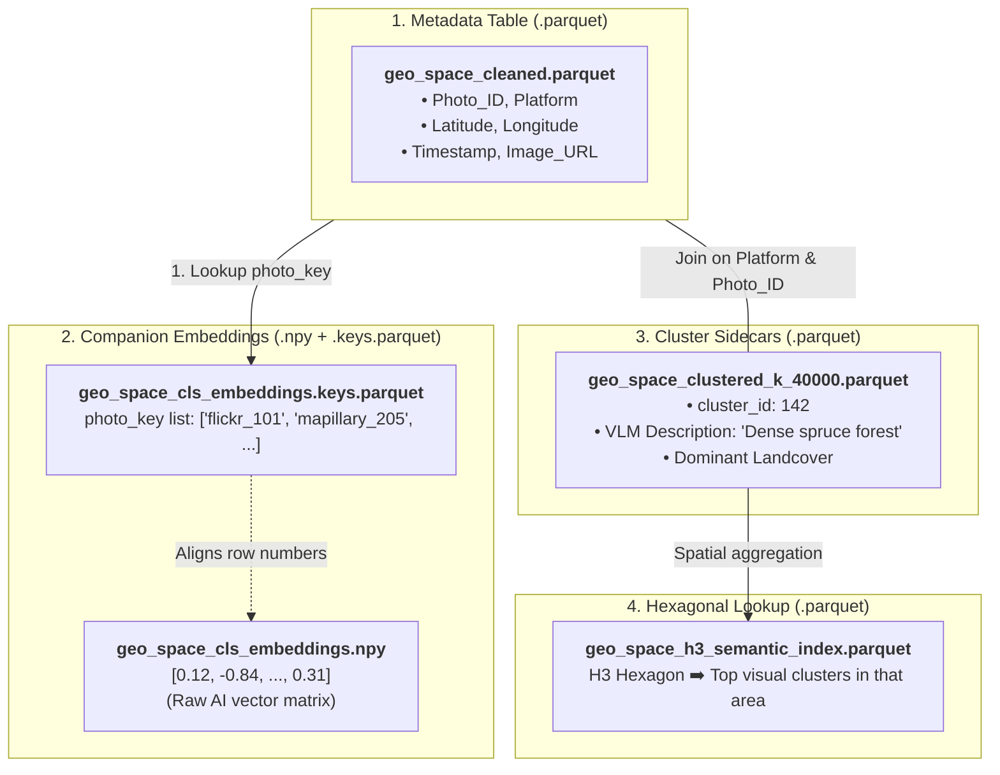
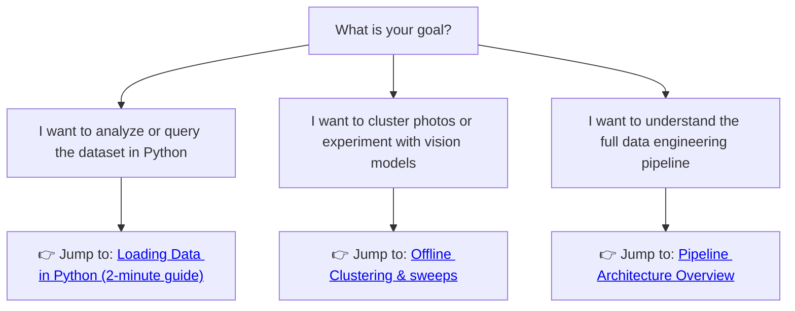

# Preliminaries & Core Concepts

Welcome to **Geo-RAG**! This guide introduces the core ideas, terminology, and architecture behind the project in plain English. If you are new to the codebase or working with large-scale geospatial imagery for the first time, start here before diving into the detailed pipeline stages.

---

## 💡 What is Geo-RAG in 30 Seconds?

Imagine you have **millions of ground-level photos** scattered across the globe—street views from Mapillary, traveler pictures from Flickr, and biodiversity sightings from iNaturalist:

1. **Clean & Deduplicate**: We filter out broken GPS coordinates, coastal glitches, and duplicate snapshots taken at the exact same tree or streetlight.
2. **AI Feature Extraction**: We convert each image into a mathematical "visual fingerprint" (an embedding vector) using modern vision models (e.g., Vision Transformers, DINOv2, SigLIP).
3. **Global Clustering**: We group millions of photos across the planet into tens of thousands of visual landscape categories (e.g., *"Alpine meadows"*, *"Suburban cul-de-sacs"*, *"Desert sand dunes"*).
4. **AI Auto-Labeling**: We show representative photos from each cluster to a Vision-Language Model (VLM) so it can automatically write descriptive, human-readable captions.
5. **Hexagonal Spatial Index**: We index the clusters into Uber's global **H3 honeycomb grid**, enabling sub-millisecond geographic lookups and interactive web dashboards.

---

## 🗺️ The Mental Model: How Data Fits Together

A frequent question from newcomers is: *“Where are the images, where are the numbers, and how do they connect?”*

Because storing 7+ million 768-dimensional AI vectors inside a single table would result in a bloated, unreadable file that crashes your computer's RAM, Geo-RAG separates data into **three lightweight, linked components**:

### Why this design?

* **Zero duplication**: You can test 5 different clustering algorithms without re-saving the coordinates or re-downloading images.
* **Instant filtering**: You can filter metadata in Pandas or DuckDB in milliseconds, then pull only the exact embedding rows you need.

---

## 🔑 The 6 Fundamental Concepts

### 1. Geotagged Photo & `photo_key`

A geotagged photo is simply an image paired with coordinates (`Latitude`, `Longitude`), a capture `Timestamp`, and a source platform (`flickr`, `mapillary`, `inaturalist`).
Every photo in Geo-RAG is uniquely identified by a composite string called `photo_key`:
$$\text{photo\_key} = \texttt{\{platform\}\_\{\text{photo\_id}\}}$$
*(Example: `flickr_14029482` or `mapillary_938104821`)*.

### 2. Visual Embedding (The AI Fingerprint)

A vision model (like a Vision Transformer) inspects a picture and converts its visual appearance into an array of numbers (e.g., 768 floating-point values).

* Two photos of snowy mountains will have **very similar numbers** (high cosine similarity).
* A photo of a desert and a photo of a neon city will have **very different numbers**.
These matrices are stored in standard NumPy binary files (`.npy`).

### 3. Decoupled Storage & Sidecar Files

Instead of rewriting the entire multi-gigabyte dataset whenever you calculate something new (like cluster assignments or AI descriptions), Geo-RAG writes a **Sidecar Parquet**.
A sidecar only contains the primary key (`Platform`, `Photo_ID`) plus the new calculated columns. When you load the dataset in Python, Geo-RAG merges the sidecar onto the base table automatically in memory.

### 4. H3 Spatial Hexagons

Rather than drawing arbitrary administrative boundaries (which vary wildly between countries) or calculating slow geometric polygons, Geo-RAG uses **Uber's H3 Grid System**.
H3 covers the entire surface of the Earth in uniform, nested hexagons:

* **Resolution 3**: Large regional cells (~11,000 km² each, great for global overview maps).
* **Resolution 7**: City-neighborhood scale (~5 km²).
* **Resolution 11**: Fine street-corner scale (~2,000 m², used for detecting duplicates).

### 5. Clusters, Centroids & Medoids

* **Cluster**: A group of photos that look visually similar.
* **Centroid**: The mathematical average vector of all photos in that cluster (an abstract point in 768-dimensional space).
* **Medoid**: The **single real photograph** whose embedding is closest to the centroid. When we want an AI model or a human to inspect Cluster #42, we look at its medoid!

### 6. Online vs. Offline Datasets

Geo-RAG operates in two modes depending on your workflow:

* **Online Dataset (`geo_space_cleaned.parquet`)**: Contains remote URLs (`https://...`). Best for lightweight exploration or streaming downloads.
* **Offline Dataset (`geo_space_cleaned_offline.parquet`)**: Points to local image files on your hard drive (`./images/flickr/101.jpg`). Ideal for training vision models, fast benchmarking, and running clustering sweeps without internet access.

---

## 📖 Plain-English Glossary

| Term | What It Means |
| :--- | :--- |
| **Backfilling** | Scanning a dataset, finding images that don't have embeddings yet, and computing only the missing ones. |
| **Zero-Inference Slicing** | Deriving new embeddings without using a GPU. For example, cutting a 1536-dim combined embedding in half to get a 768-dim `cls` embedding in milliseconds using NumPy memory mapping. |
| **Purging** | Removing corrupted records (e.g., GPS receiver glitches where a car's tracker got stuck at a fixed latitude). |
| **Synchronization (`sync_offline_dataset`)** | Making sure your local offline `.parquet` and `.npy` files stay in 100% agreement when records are deleted from the master online dataset. |
| **VLM / MLLM** | Vision-Language Model (e.g., Qwen2-VL, LLaVA). An AI model that takes photos as input and outputs text describing their landscape and vegetation. |
| **SGLang** | A high-performance inference engine used to serve VLMs quickly via Docker. |
| **FAISS** | Facebook AI Similarity Search. A GPU-accelerated library that can cluster millions of 768-dimensional vectors in minutes. |
| **Spatial Block Hold-Out** | A validation technique where you train on some geographic regions and test on unseen regions to make sure your model isn't just memorizing specific locations. |

---

## 🧭 Choose Your Journey: Where to Go Next

Depending on what you want to achieve, pick the relevant guide:

* 🟢 **To load data in 2 lines of Python**: Head over to the [Dataset Guide](dataset.md).
* 🟡 **To run clustering or evaluate vision models on your local GPU**: Check out the [Offline Pipeline Guide](pipeline.md#3-offline-pipeline-model-representation-sweeps-scriptspipelinerun_offline_pipelinesh).
* 🔴 **To understand how data is collected, cleaned, and processed step-by-step**: Read the [Pipeline Architecture Walkthrough](pipeline.md).
