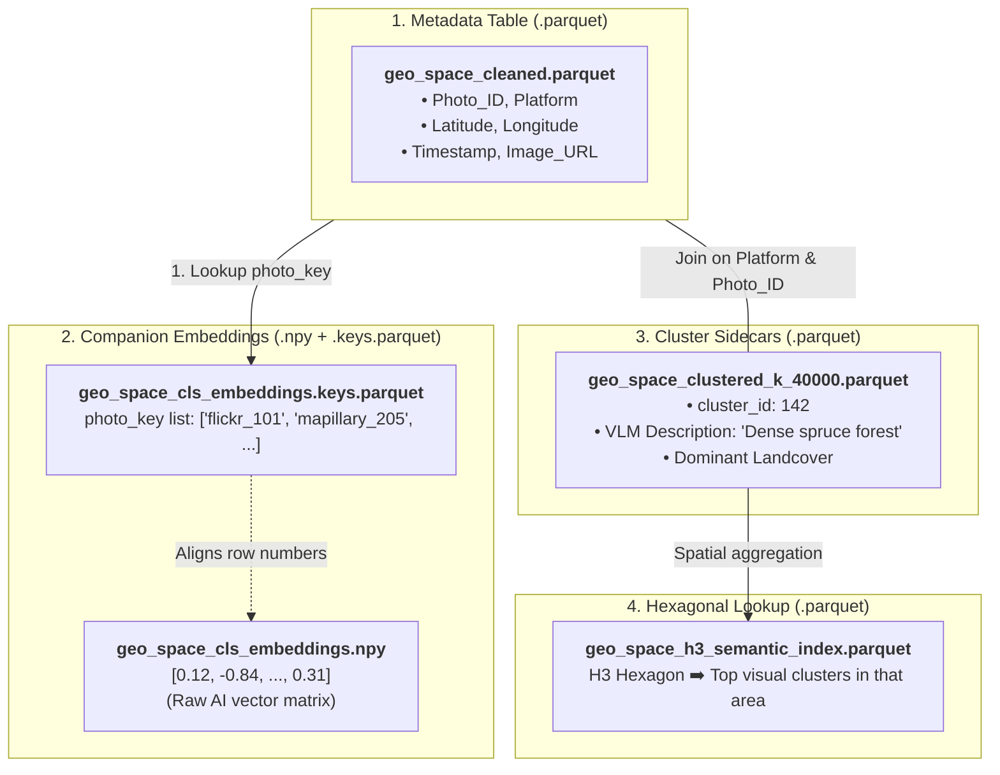
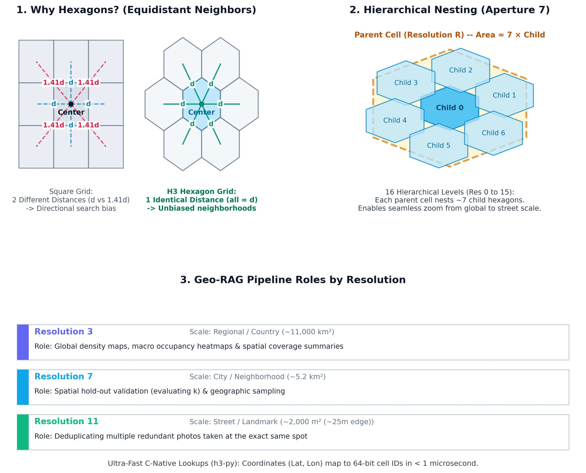
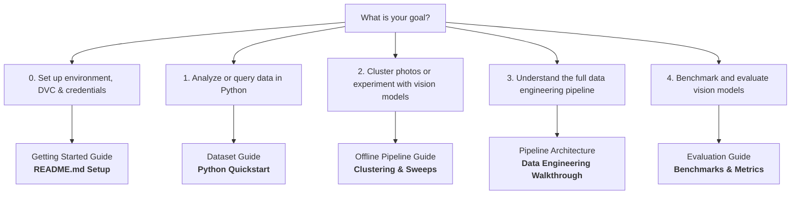

# Preliminaries & Core Concepts

Welcome to **Geo-RAG**! This guide introduces the core ideas, terminology, and architecture behind the project in plain English. If you are new to the codebase or working with large-scale geospatial imagery for the first time, start here before diving into the detailed pipeline stages.

> [!TIP] Setting Up Your Local Environment & Data
> If you are looking to install dependencies, pull the dataset via DVC, configure API credentials (`.env`), or customize local machine paths (`config/local.yaml`), jump straight to the **[Getting Started Guide in README.md](../README.md#getting-started)**.

---

## 💡 What is Geo-RAG in 30 Seconds?

Imagine you have **millions of ground-level photos** scattered across the globe—street views from Mapillary, traveler pictures from Flickr, and biodiversity sightings from iNaturalist:

1. **Clean & Deduplicate**: We filter out broken GPS coordinates, coastal glitches, and duplicate snapshots taken at the exact same tree or streetlight.
2. **AI Feature Extraction**: We convert each image into a mathematical "visual fingerprint" (an embedding vector) using modern vision models (e.g., Vision Transformers, DINOv2, SigLIP).
3. **Global Clustering**: We group millions of photos across the planet into tens of thousands of visual landscape categories (e.g., *"Alpine meadows"*, *"Suburban cul-de-sacs"*, *"Desert sand dunes"*).
4. **AI Auto-Labeling**: We show representative photos from each cluster to a Vision-Language Model (VLM) so it can automatically write descriptive, human-readable captions.
5. **Hexagonal Spatial Index**: We index the clusters into Uber's global **H3 honeycomb grid**, enabling sub-millisecond geographic lookups and interactive web dashboards.

---

## 🗺️ The Mental Model: How Data Fits Together

A frequent question from newcomers is: *“Where are the images, where are the numbers, and how do they connect?”*

Because storing 7+ million 768-dimensional AI vectors inside a single table would result in a bloated, unreadable file that crashes your computer's RAM, Geo-RAG separates data into **three lightweight, linked components**:

### Why this design?

* **Zero duplication**: You can test 5 different clustering algorithms without re-saving the coordinates or re-downloading images.
* **Instant filtering**: You can filter metadata in Pandas or DuckDB in milliseconds, then pull only the exact embedding rows you need.

---

## 🔑 The 6 Fundamental Concepts

### 1. Geotagged Photo & `photo_key`

A geotagged photo is simply an image paired with coordinates (`Latitude`, `Longitude`), a capture `Timestamp`, and a source platform (`flickr`, `mapillary`, `inaturalist`).
Every photo in Geo-RAG is uniquely identified by a composite string called `photo_key`:
$$\text{photo\_key} = \texttt{\{platform\}\_\{\text{photo\_id}\}}$$
*(Example: `flickr_14029482` or `mapillary_938104821`)*.

### 2. Visual Embedding (The AI Fingerprint)

A vision model (like a Vision Transformer) inspects a picture and converts its visual appearance into an array of numbers (e.g., 768 floating-point values).

* Two photos of snowy mountains will have **very similar numbers** (high cosine similarity).
* A photo of a desert and a photo of a neon city will have **very different numbers**.
These matrices are stored in standard NumPy binary files (`.npy`).

### 3. Decoupled Storage & Sidecar Files

Instead of rewriting the entire multi-gigabyte dataset whenever you calculate something new (like cluster assignments or AI descriptions), Geo-RAG writes a **Sidecar Parquet**.
A sidecar only contains the primary key (`Platform`, `Photo_ID`) plus the new calculated columns. When you load the dataset in Python, Geo-RAG merges the sidecar onto the base table automatically in memory.

### 4. H3 Spatial Hexagons (The Global Honeycomb)

Rather than drawing arbitrary administrative boundaries (which vary wildly between countries) or doing slow polygon math, Geo-RAG divides the entire surface of the Earth into **Uber's H3 Hexagonal Hierarchical Spatial Index**.

#### Why Hexagons Instead of Squares?

* **Uniform Neighbor Distances**: In a square grid, the 4 diagonal neighbors are $\approx 1.41\times$ farther away than the 4 cardinal neighbors. In an H3 hexagonal grid, **all 6 neighbors are at the exact same distance ($d$)**, eliminating directional distortion during spatial search.
* **Minimal Geometric Distortion**: Hexagons tessellate the spherical curvature of the Earth with less area distortion than latitude/longitude degree bounding boxes.
* **Hierarchical Nesting (Aperture 7)**: H3 defines 16 resolution levels (Res 0 to 15). Each coarser parent cell neatly nests ~7 child hexagons, enabling seamless zooming from global views down to individual street corners.

#### How Geo-RAG Uses H3:

| Resolution | Average Cell Area | Real-World Scale | Geo-RAG Role |
| :--- | :--- | :--- | :--- |
| **Resolution 3** | ~11,000 km² | Region / State | **Global Density & Occupancy Maps**: Powers macro-level heatmaps and visual coverage dashboards. |
| **Resolution 7** | ~5.2 km² | City / Neighborhood | **Spatial Hold-Out Validation**: Splitting geographic areas into train/test sets to evaluate optimal cluster count ($k$) without spatial leakage. |
| **Resolution 11** | ~2,000 m² (~25m edge) | Street Corner / Tree | **Spatial Deduplication**: Groups photos taken within ~25 meters of each other and retains only visually distinct shots via cosine similarity. |

Every latitude/longitude coordinate converts into a 64-bit H3 index string (e.g., `8826856235fffff`) in **$<1$ microsecond** using C-accelerated lookups.

### 5. Clusters, Centroids & Medoids

* **Cluster**: A group of photos that look visually similar (e.g., photos of coniferous pine forests).
* **Centroid**: The mathematical average vector of all photos in that cluster (an abstract point in 768-dimensional space).
* **Medoid**: The **single real photograph** whose embedding is closest to the centroid. When we want an AI model or a human to inspect Cluster #42, we look at its medoid!

### 6. Online vs. Offline Datasets

Geo-RAG operates in two modes depending on your workflow:

* **Online Dataset (`geo_space_cleaned.parquet`)**: Contains remote URLs (`https://...`). Best for lightweight exploration or streaming downloads.
* **Offline Dataset (`geo_space_cleaned_offline.parquet`)**: Points to local image files on your hard drive (`./images/flickr/101.jpg`). Ideal for training vision models, fast benchmarking, and running clustering sweeps without internet access.

---

## 🧪 How Do We Evaluate Models? (The Benchmark Suites)

When vision models (like TIPSv2, DINOv2, or SigLIP) produce embeddings for millions of images, **our evaluation benchmarks measure whether those representations effectively retain critical information about the scene, environment, and landscape**—and how reliably we can leverage that information for downstream spatial mapping and retrieval.

Similarly, we experiment with various textual captioning strategies and prompts across different Multimodal Large Language Models (MLLMs) to evaluate **which generated captions best capture the necessary details to answer questions about the image regarding land use, land cover, and environmental characteristics.**

Geo-RAG organizes these evaluations into three standardized benchmarking suites:

### 1. Ecological & Environmental Information Retention (LUCAS 2018 & EUNIS)

* **The Question**: Do image embeddings preserve enough environmental information to group ecologically equivalent landscapes together, even when images are taken hundreds of kilometers apart?
* **Ground-Truth Sources**:
  * **LUCAS 2018**: European Union field surveyors physically visited hundreds of thousands of GPS points across Europe to record certified **Land Cover** (e.g., Cropland, Coniferous Woodland) and **Land Use** (e.g., Agriculture, Forestry).
  * **EUNIS Ecosystem Maps**: High-resolution European Environment Agency (EEA) raster maps classifying habitats across three nested taxonomic levels (Macro, Meso, and Exact).
* **The Benchmark**: We perform $k$-Nearest-Neighbor retrieval. If we query a photo taken in an alpine spruce forest in Austria, do the nearest retrieved representations from across Europe also correspond to alpine spruce habitats?

### 2. Scene & Context Recognition (Places365)

* **The Question**: How well do representation vectors retain scene-level semantics across diverse outdoor and indoor settings?
* **The Benchmark**: Measures retrieval precision across the Places365 3-tier hierarchy:
  * **Exact Category** (e.g., *mountain*, *harbor*, *bamboo forest*).
  * **Sub-Category** (e.g., *water*, *cultivated land*, *commercial area*).
  * **Macro Category** (*indoor* vs. *outdoor natural* vs. *outdoor man-made*).

### 3. MLLM Captioning Quality & Cross-Modal Retrieval

* **The Question**: Which MLLM and prompt designs generate captions that most accurately describe the image, and can those captions be used to reliably answer questions about land cover and scene elements?
* **The Benchmark**:
  * **Captioning & Question Answering (`caption_test.py`, `evaluate_lucas.py`)**: We test multiple MLLMs (e.g., LLaVA, Qwen-VL) across different structured prompt templates to extract visible evidence, human activities, and vegetation types. We evaluate how accurately these structured descriptions answer specific questions regarding ground-truth land cover and land use classes.
  * **Cross-Modal Retrieval (`evaluate_retrieval.py`)**: Measures whether text embeddings of MLLM captions align with raw visual feature vectors in a joint space, testing both *Text-to-Image* and *Image-to-Text* retrieval accuracy.

---

### 🛡️ Preventing "Spatial Leakage" (Spatial Block Partitioning)

A major trap in geospatial machine learning is **spatial data leakage**:

* If a street-view camera drives down a road and captures 10 photos 2 meters apart, a naive random 80/20 train/test split puts 8 photos in the database and 2 in the test set.
* The model can easily achieve high scores simply by matching the exact same street corner, building facade, or lighting condition, without actually encoding generalizable environmental features.

> [!IMPORTANT] The Spatial Block Solution
> In all Geo-RAG retrieval benchmarks ([`benchmark_lucas.py`](evaluation.md#4-lucas-semantic-retrieval-benchmarking-benchmark_lucaspy), [`benchmark_eunis.py`](evaluation.md#6-eunis-ecosystem-map-retrieval-benchmarking-benchmark_eunispy)), we partition queries and database pools into **H3 Resolution 4 parent blocks (~11,000 km²)** using **Greedy Block Stratification**.
> The test queries come from **completely different geographic territories** than the search database. This guarantees that representations are evaluated on whether they encode **generalizable ecological information**, rather than memorized local scenes.

For a complete walkthrough of precision metrics ($P@K$, $mAP$, $MRR$), see the **[Evaluation Methodology Guide](evaluation.md)** and **[Metrics Reference](metrics.md)**.

---

## 📖 Plain-English Glossary

| Term | What It Means |
| :--- | :--- |
| **Backfilling** | Scanning a dataset, finding images that don't have embeddings yet, and computing only the missing ones. |
| **Zero-Inference Slicing** | Deriving new embeddings without using a GPU. For example, cutting a 1536-dim combined embedding in half to get a 768-dim `cls` embedding in milliseconds using NumPy memory mapping. |
| **Purging** | Removing corrupted records (e.g., GPS receiver glitches where a car's tracker got stuck at a fixed latitude). |
| **Synchronization (`sync_offline_dataset`)** | Making sure your local offline `.parquet` and `.npy` files stay in 100% agreement when records are deleted from the master online dataset. |
| **VLM / MLLM** | Vision-Language Model (e.g., Qwen2-VL, LLaVA). An AI model that takes photos as input and outputs text describing their landscape and vegetation. |
| **SGLang** | A high-performance inference engine used to serve VLMs quickly via Docker. |
| **FAISS** | Facebook AI Similarity Search. A GPU-accelerated library that can cluster millions of 768-dimensional vectors in minutes. |
| **Spatial Block Hold-Out** | A validation technique where you train on some geographic regions and test on unseen regions to make sure your model isn't just memorizing specific locations. |

---

## 🧭 Choose Your Journey: Where to Go Next

| Your Goal | Where to Start | What You'll Learn |
| :--- | :--- | :--- |
| 🚀 **Set up environment & data** | 👉 **[Getting Started Guide](../README.md#getting-started)** | Set up Conda environment, configure `.env` tokens, pull DVC data, and customize `config/local.yaml`. |
| 🟢 **Use data in Python** | 👉 **[Loading Data in Python](dataset.md#loading-data-in-python)** | 2-minute quickstart to load metadata, sidecars, and embeddings into Pandas/DuckDB. |
| 🟡 **Experiment with models** | 👉 **[Offline Clustering Guide](pipeline.md#3-offline-pipeline-model-representation-sweeps-scriptspipelinerun_offline_pipelinesh)** | Run clustering sweeps and derive embeddings on your GPU without re-scraping. |
| 🔴 **Learn the pipeline** | 👉 **[Pipeline Architecture Walkthrough](pipeline.md)** | Step-by-step deep dive into ingestion, GPS cleaning, FAISS clustering, and VLM labeling. |
| 🟣 **Benchmark vision models** | 👉 **[Evaluation Methodology Guide](evaluation.md)** | Evaluate models on LUCAS 2018, EUNIS ecosystem rasters, Places365, and cross-modal retrieval. |
